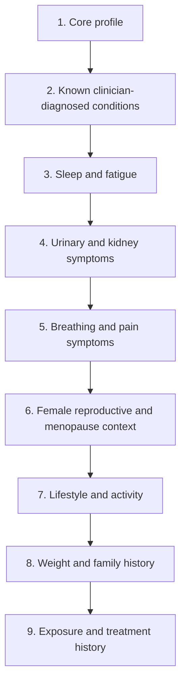

# NHANES Combined Question Flow Visualization

Version: `1.0.0`

## Conditions covered

- Menopause
- Thyroid problems
- Kidney problems
- Sleep disorder
- Anemia
- Liver / hepatic insufficiency
- Prediabetes
- Hidden inflammation
- Electrolyte deficiency / imbalance
- Hepatitis B & C

## High-level flow

## Detailed structure

### 1. Core profile (`demographics`)

#### 1.1 q_age

- Text: What is your age?
- Type: `number` (Numeric input)
- Used for: all
- Maps to: `age_years`
- Explicit options in JSON: none
- Expected answer format: Numeric input

#### 1.2 q_gender

- Text: What sex were you assigned at birth?
- Type: `single_select` (Single choice)
- Used for: all
- Maps to: `gender`
- Answer options:
  - `Female`
  - `Male`

#### 1.3 q_body_size

- Text: Enter your current height, weight, and waist size if known.
- Type: `grouped_numeric` (Grouped numeric / mixed entry)
- Used for: menopause, thyroid, kidney, liver, hidden_inflammation, hepatitis_bc
- Maps to: `height_cm, weight_kg, bmi, waist_cm`
- Explicit options in JSON: none
- Expected answer format: Grouped numeric / mixed entry

#### 1.4 q_demographics_context

- Text: What is your race/ethnicity, education level, country of birth, and household income-to-poverty ratio if known?
- Type: `grouped_demographic` (Grouped demographic entry)
- Used for: hepatitis_bc
- Maps to: `ethnicity, education, country_of_birth, income_poverty_ratio`
- Explicit options in JSON: none
- Expected answer format: Grouped demographic entry

### 2. Known clinician-diagnosed conditions (`known_conditions`)

#### 2.1 q_known_dx

- Text: Which of these have you ever been told by a doctor or health professional that you have or had?
- Type: `multi_select` (Multiple choice)
- Used for: thyroid, kidney, sleep_disorder, liver, prediabetes, hidden_inflammation, electrolytes, hepatitis_bc
- Answer options:
  - `High blood pressure` -> `bpq020___ever_told_you_had_high_blood_pressure`
  - `High cholesterol` -> `bpq080___doctor_told_you___high_cholesterol_level`
  - `Diabetes` -> `diq010___doctor_told_you_have_diabetes`
  - `Weak or failing kidneys` -> `kiq022___ever_told_you_had_weak/failing_kidneys?`
  - `Kidney stones` -> `kiq026___ever_had_kidney_stones?`
  - `Arthritis` -> `mcq160a___ever_told_you_had_arthritis`
  - `Heart failure` -> `mcq160b___ever_told_you_had_congestive_heart_failure`
  - `Heart attack` -> `mcq160e___ever_told_you_had_heart_attack`
  - `Stroke` -> `mcq160f___ever_told_you_had_stroke`
  - `Asthma` -> `mcq010___ever_been_told_you_have_asthma`
  - `COPD / emphysema / chronic bronchitis` -> `mcq160p___ever_told_you_had_copd_emphysema`
  - `Liver condition` -> `mcq160l___ever_told_you_had_any_liver_condition`

#### 2.2 q_medications

- Text: Are you currently taking medicines for high blood pressure, diabetes, anemia, hepatitis, or any prescription medicines at all?
- Type: `multi_select_with_count` (Multiple choice + medication count)
- Used for: menopause, thyroid, kidney, anemia, liver, electrolytes
- Derives: `med_count`
- Answer options:
  - `Blood pressure prescription` -> `bpq040a___taking_prescription_for_hypertension`
  - `Insulin` -> `diq050___taking_insulin_now`
  - `Diabetes pills` -> `diq070___take_diabetic_pills_to_lower_blood_sugar`
  - `Anemia treatment` -> `mcq053___taking_treatment_for_anemia/past_3_mos`
  - `Any prescription medicine in past month` -> `rxduse___taken_prescription_medicine,_past_month`

#### 2.3 q_general_health

- Text: How would you rate your general health, and were you hospitalized overnight in the last year?
- Type: `grouped_single_select` (Grouped select response)
- Used for: thyroid, kidney, anemia, liver, hidden_inflammation, hepatitis_bc
- Maps to: `huq010___general_health_condition, huq071___overnight_hospital_patient_in_last_year`
- Explicit options in JSON: none
- Expected answer format: Grouped select response

### 3. Sleep and fatigue (`sleep_fatigue`)

#### 3.1 q_sleep_quality

- Text: How often do you snore, and has a doctor ever told you that you had trouble sleeping?
- Type: `grouped_single_select` (Grouped select response)
- Used for: thyroid, sleep_disorder, prediabetes, hidden_inflammation
- Maps to: `slq030___how_often_do_you_snore?, slq050___ever_told_doctor_had_trouble_sleeping?`
- Explicit options in JSON: none
- Expected answer format: Grouped select response

#### 3.2 q_fatigue

- Text: Over the last two weeks, how often have you felt tired or had little energy?
- Type: `single_select` (Single choice)
- Used for: kidney, sleep_disorder, anemia, prediabetes, electrolytes
- Maps to: `dpq040___feeling_tired_or_having_little_energy, fatigue_ordinal`
- Explicit options in JSON: none
- Expected answer format: Single choice

#### 3.3 q_sleep_schedule

- Text: What time do you usually go to sleep and wake up on workdays and on weekends, and how many hours do you usually sleep?
- Type: `grouped_time_and_duration` (Grouped time + duration entry)
- Used for: thyroid, sleep_disorder, prediabetes, hidden_inflammation
- Maps to: `slq300___usual_sleep_time_on_weekdays_or_workdays, slq310___usual_wake_time_on_weekdays_or_workdays, sld012___sleep_hours___weekdays_or_workdays, slq320___usual_sleep_time_on_weekends, slq330___usual_wake_time_on_weekends, sld013___sleep_hours___weekends`
- Derives: `cos_weekday_wake, sin_weekday_wake, sin_weekday_bedtime, social_jetlag`
- Explicit options in JSON: none
- Expected answer format: Grouped time + duration entry

### 4. Urinary and kidney symptoms (`urinary_kidney`)

#### 4.1 q_urinary_leakage

- Text: Do you have urinary leakage, and if yes does it happen with physical activity or before reaching the toilet?
- Type: `grouped_branching` (Grouped branching follow-up)
- Used for: menopause, kidney, anemia, prediabetes
- Maps to: `kiq005___how_often_have_urinary_leakage?, kiq042___leak_urine_during_physical_activities?, kiq430___how_frequently_does_this_occur?, kiq044___urinated_before_reaching_the_toilet?, kiq450___how_frequently_does_this_occur?`
- Explicit options in JSON: none
- Expected answer format: Grouped branching follow-up

#### 4.2 q_nocturia

- Text: How many times do you usually urinate during the night?
- Type: `number` (Numeric input)
- Used for: thyroid, kidney, prediabetes, electrolytes
- Maps to: `kiq480___how_many_times_urinate_in_night?`
- Explicit options in JSON: none
- Expected answer format: Numeric input

#### 4.3 q_kidney_history

- Text: Have you ever been told you had weak or failing kidneys, received dialysis, or had kidney stones?
- Type: `multi_select` (Multiple choice)
- Used for: kidney, electrolytes, hepatitis_bc
- Answer options:
  - `Weak or failing kidneys` -> `kiq022___ever_told_you_had_weak/failing_kidneys?`
  - `Kidney stones` -> `kiq026___ever_had_kidney_stones?`

### 5. Breathing and pain symptoms (`cardiorespiratory_pain`)

#### 5.1 q_breathing

- Text: Do you get shortness of breath when walking up stairs or inclines?
- Type: `single_select` (Single choice)
- Used for: sleep_disorder, anemia, liver
- Maps to: `cdq010___shortness_of_breath_on_stairs/inclines`
- Explicit options in JSON: none
- Expected answer format: Single choice

#### 5.2 q_pain

- Text: Have you had chest pain or abdominal pain in the past year, and have you seen a doctor about it?
- Type: `grouped_branching` (Grouped branching follow-up)
- Used for: anemia, liver
- Maps to: `cdq001___sp_ever_had_pain_or_discomfort_in_chest, mcq520___abdominal_pain_during_past_12_months?, mcq540___ever_seen_a_dr_about_this_pain`
- Explicit options in JSON: none
- Expected answer format: Grouped branching follow-up

### 6. Female reproductive and menopause context (`female_reproductive`)

#### 6.1 q_repro_status

- Text: Are you currently pregnant or have you ever been pregnant?
- Type: `grouped_single_select` (Grouped select response)
- Used for: menopause, thyroid
- Show if: `{"gender": ["Female"]}`
- Maps to: `pregnancy_status, rhq131___ever_been_pregnant?`
- Explicit options in JSON: none
- Expected answer format: Grouped select response

#### 6.2 q_periods

- Text: Have you had regular menstrual periods in the past 12 months?
- Type: `single_select` (Single choice)
- Used for: liver, hidden_inflammation
- Show if: `{"gender": ["Female"]}`
- Maps to: `rhq031___had_regular_periods_in_past_12_months`
- Explicit options in JSON: none
- Expected answer format: Single choice

### 7. Lifestyle and activity (`lifestyle`)

#### 7.1 q_activity

- Text: Which of these do you do: vigorous work activity, vigorous recreational activity, moderate recreational activity, or moderate work activity? How many days per week?
- Type: `grouped_activity` (Grouped activity and frequency entry)
- Used for: menopause, thyroid, kidney, sleep_disorder, prediabetes, hidden_inflammation, electrolytes
- Maps to: `paq605___vigorous_work_activity, paq625___number_of_days_moderate_work, paq650___vigorous_recreational_activities, paq665___moderate_recreational_activities, paq670___days_moderate_recreational_activities`
- Explicit options in JSON: none
- Expected answer format: Grouped activity and frequency entry

#### 7.2 q_alcohol

- Text: How many alcoholic drinks do you usually have per day, and how often do you have 4 or 5 or more drinks on one occasion?
- Type: `grouped_numeric` (Grouped numeric / mixed entry)
- Used for: thyroid, sleep_disorder, prediabetes, hidden_inflammation, liver, hepatitis_bc
- Maps to: `alq130___avg_#_alcoholic_drinks/day___past_12_mos, alq151___ever_have_4/5_or_more_drinks_every_day?, alq170___past_30_days_#_times_4_5_drinks_on_an_oc`
- Derives: `ever_heavy_drinker`
- Explicit options in JSON: none
- Expected answer format: Grouped numeric / mixed entry

#### 7.3 q_smoking

- Text: Do you smoke now, have you smoked at least 100 cigarettes in your life, and how many cigarettes per day do you smoke?
- Type: `grouped_numeric` (Grouped numeric / mixed entry)
- Used for: thyroid, hidden_inflammation, hepatitis_bc
- Maps to: `smq020___smoked_at_least_100_cigarettes_in_life, smq040___do_you_now_smoke_cigarettes?, smd650___avg_#_cigarettes/day_during_past_30_days`
- Explicit options in JSON: none
- Expected answer format: Grouped numeric / mixed entry

#### 7.4 q_work_schedule

- Text: What is your overall work schedule, what kind of work did you do last week, and how many hours did you work?
- Type: `grouped_work` (Grouped work-pattern entry)
- Used for: thyroid, anemia, liver, hidden_inflammation
- Maps to: `ocq670___overall_work_schedule_past_3_months, ocd150___type_of_work_done_last_week, ocq180___hours_worked_last_week_in_total_all_jobs`
- Explicit options in JSON: none
- Expected answer format: Grouped work-pattern entry

### 8. Weight and family history (`weight_family_history`)

#### 8.1 q_weight_context

- Text: Has a doctor ever told you that you were overweight, would you like to weigh more or less, and have you tried to lose weight in the past year?
- Type: `grouped_single_select` (Grouped select response)
- Used for: thyroid, kidney, liver, prediabetes, hidden_inflammation
- Maps to: `mcq080___doctor_ever_said_you_were_overweight, whq040___like_to_weigh_more,_less_or_same, whq070___tried_to_lose_weight_in_past_year`
- Explicit options in JSON: none
- Expected answer format: Grouped select response

#### 8.2 q_family_history

- Text: Do you have a close relative with diabetes?
- Type: `single_select` (Single choice)
- Used for: prediabetes
- Maps to: `mcq300c___close_relative_had_diabetes`
- Explicit options in JSON: none
- Expected answer format: Single choice

### 9. Exposure and treatment history (`exposures`)

#### 9.1 q_transfusion

- Text: Have you ever received a blood transfusion, and if yes what year was it?
- Type: `grouped_branching` (Grouped branching follow-up)
- Used for: kidney, anemia, liver, hepatitis_bc
- Maps to: `mcq092___ever_receive_blood_transfusion, mcd093___year_receive_blood_transfusion`
- Explicit options in JSON: none
- Expected answer format: Grouped branching follow-up

## Derived / lab-only features kept outside the interactive quiz

- `sbp_mean`
- `dbp_mean`
- `pulse_mean`
- `med_count`
- `iron_deficiency`
- `fatigue_ordinal`
- `cos_weekday_wake`
- `sin_weekday_wake`
- `sin_weekday_bedtime`
- `social_jetlag`
- `fasting_glucose_mg_dl`
- `hdl_cholesterol_mg_dl`
- `triglycerides_mg_dl`
- `serum_creatinine_mg_dl`
- `alt_u_l`
- `ast_u_l`
- `ggt_u_l`
- `alp_u_l`
- `total_bilirubin_mg_dl`
- `serum_albumin_g_dl`
- `ferritin_ng_ml`
- `LBXHSCRP_hs_c_reactive_protein_mg_l`
